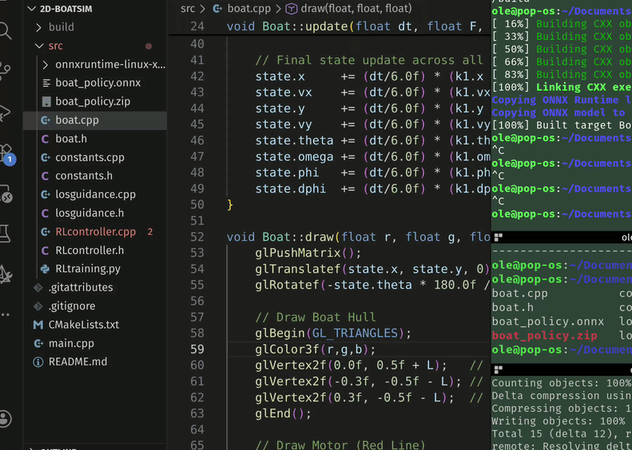

# Autonomous Surface Vessel Simulator with LOS Guidance and Reinforcement Learning Control

A real-time 2D simulation of an underactuated surface vessel, featuring a physics-accurate equations-of-motion model integrated with two competing autonomy stacks: a classical **Line-of-Sight (LOS) guidance law** and a **PPO-trained deep reinforcement learning policy** deployed via ONNX Runtime. The simulator is rendered in OpenGL and allows simultaneous comparison of a manual controller, the LOS agent, and the RL agent on an identical path-following task.

---


*Blue: manual control , Orange: LOS guidance , Green: RL policy*

---

## Motivation

Path-following control of underactuated marine surface vessels is a well-studied but non-trivial problem due to the vehicle's nonlinear dynamics, actuator coupling, and sensitivity to initial conditions. This project explores whether a model-free RL policy trained entirely in simulation can match or exceed the performance of a classical geometric guidance law, with both methods operating on the same underlying dynamic model.

---

## System Overview

```
┌──────────────────────────────────────────────────────────┐
│                      Simulator Loop                      │
│                                                          │
│   ┌─────────────┐   ┌──────────────┐   ┌─────────────┐   │
│   │ Manual      │   │ LOS + PD     │   │ RL Policy   │   │
│   │ (keyboard)  │   │ Controller   │   │ (ONNX)      │   │
│   └──────┬──────┘   └──────┬───────┘   └──────┬──────┘   │
│          │                 │                  │          │
│          └────────┬────────┘                  │          │
│                   ▼                           ▼          │
│           ┌───────────────┐         ┌──────────────────┐ │
│           │  Boat Model   │         │   Boat Model     │ │
│           │  (RK4 / EOM)  │         │   (RK4 / EOM)    │ │
│           └───────────────┘         └──────────────────┘ │
│                                                          │
│                     OpenGL Renderer                      │
└──────────────────────────────────────────────────────────┘
```

---

## Equations of Motion

The vessel is modeled as a planar rigid body with a steerable thruster mounted at distance $L$ aft of the center of mass. The full state vector is:

$$
q = [x,\ \dot{x},\ y,\ \dot{y},\ \theta,\ \omega,\ \phi,\ \dot{\phi}]^T
$$

where $\theta$ is the hull heading and $\phi$ is the motor deflection angle relative to the hull. The dynamics are:

$$
\dot{q} = \begin{bmatrix}
\dot{x} \\
\frac{1}{M}\left(F\sin(\theta+\phi) - D_v \dot{x}\right) \\
\dot{y} \\
\frac{1}{M}\left(F\cos(\theta+\phi) - D_v \dot{y}\right) \\
\omega \\
\frac{1}{I}\left(L \cdot F\sin(\phi) - D_\omega \omega\right) \\
\dot{\phi} \\
\frac{1}{I_m}\left(\tau - D_\phi \dot{\phi}\right)
\end{bmatrix}
$$

The system is integrated at each timestep using a 4th-order Runge-Kutta (RK4) scheme in `boat.cpp`, with the same implementation mirrored exactly in the Python training environment to ensure sim-to-sim fidelity.

| Parameter | Symbol | Value |
|---|---|---|
| Mass | $M$ | 5.0 kg |
| Thruster moment arm | $L$ | 1.0 m |
| Moment of inertia | $I = ML^2/12$ | , |
| Motor inertia | $I_m$ | 0.05 |
| Linear drag | $D_v$ | 1.8 |
| Angular drag | $D_\omega$ | 1.2 |
| Motor drag | $D_\phi$ | 1.5 |

---

## Control Systems

### 1. LOS Guidance + PD Control (Orange)

The classical baseline uses Fossen's **Line-of-Sight guidance law** to generate a desired heading from the cross-track error $e$ and a look-ahead distance $\Delta$:

$$
\theta_d = \gamma_p + \arctan\!\left(\frac{-e}{\Delta}\right)
$$

A cascaded **PD controller** then actuates the motor angle $\phi$ to track $\theta_d$, with gains tuned to prevent oscillation. Waypoints are switched when the vessel enters a radius $r_{wp}$ around the next target.

### 2. Reinforcement Learning Policy (Green)

A **PPO agent** is trained using Stable-Baselines3 on a 10-dimensional observation vector designed for generalization across arbitrary path headings:

| Index | Feature |
|---|---|
| 1–2 | $\sin(\Delta\theta),\ \cos(\Delta\theta)$ : heading error |
| 3–4 | $v_\text{along},\ v_\text{cross}$ : path-frame velocities |
| 5 | $\omega$ : hull angular rate |
| 6–7 | $\phi,\ \dot{\phi}$ : motor state |
| 8 | $e$ : cross-track error |
| 9 | Normalized along-track progress |
| 10 | Remaining distance to segment end |

During training the path direction is randomized uniformly over $[0, 2\pi)$ at each episode reset, forcing the agent to learn a heading-agnostic path-following policy rather than memorizing a fixed route. The reward function combines exponential cross-track penalty, heading alignment, and forward velocity incentive:

$$
r = 0.5\,e^{-e^2/4} + 0.5\cos(\Delta\theta) + 4\,\frac{v_\text{along}}{F_\text{max}/M} - 0.5
$$

with additional penalties for reversing, motor deflection, and excessive angular rate. The trained policy is exported to **ONNX** format and loaded at runtime via the ONNX Runtime C++ API, with no Python dependency at inference time.

---

## Repository Structure

```
.
├── main.cpp                  # Simulation loop and OpenGL renderer
├── src/
│   ├── boat.cpp / boat.h     # Vessel dynamics (RK4)
│   ├── constants.cpp / .h    # Physical and control parameters
│   ├── losguidance.cpp / .h  # LOS guidance + PD controller
│   ├── RLcontroller.cpp / .h # ONNX Runtime inference wrapper
│   ├── RLtraining.py         # PPO training environment (SB3)
│   └── boat_policy.onnx      # Pre-trained policy (ONNX)
├── CMakeLists.txt
└── README.md
```

---

## Build and Run

**Dependencies:** OpenGL, GLEW, GLFW3, [ONNX Runtime](https://github.com/microsoft/onnxruntime/releases) (extract into `src/`)

```bash
mkdir build && cd build
cmake ..
make
./BoatSim
```

The build system copies `boat_policy.onnx` and the ONNX Runtime shared libraries into the output directory automatically.

**Controls:**

| Key | Action |
|---|---|
| ↑ / ↓ | Thrust forward / reverse |
| ← / → | Steer motor left / right |

---

## Training Your Own Policy

```bash
cd src
pip install stable-baselines3 gymnasium torch onnx
python RLtraining.py
```

Training completes at approximately 500k timesteps. The script saves both a SB3 `.zip` checkpoint and exports the policy to `boat_policy.onnx` for C++ deployment.

---

## Technical Highlights

- **Sim-to-deploy consistency** : the Python training environment replicates the C++ RK4 integrator and coordinate conventions exactly, eliminating a common source of policy degradation at deployment
- **Coordinate-frame–agnostic observations** : path-relative velocity projections and $\sin/\cos$ heading encoding allow the policy to generalize to paths of any orientation without retraining
- **Zero-overhead inference** : the ONNX Runtime C++ API runs the neural network policy at simulation framerate with no Python interpreter in the loop
- **Direct comparison** : all three controllers (manual, LOS, RL) run concurrently on separate instances of the same dynamic model, enabling side-by-side performance evaluation
